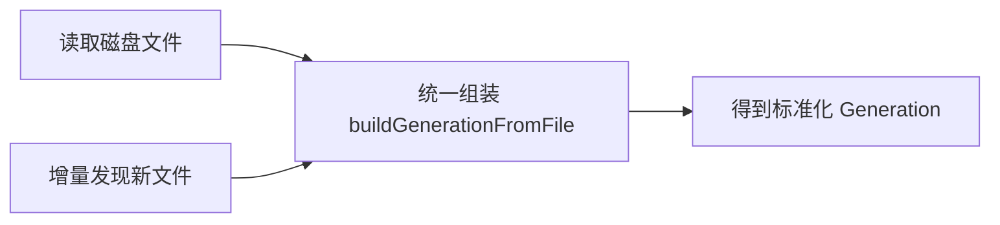

# 1. 问题

在 app/api/history/route.ts 中，读取磁盘历史记录与增量同步两处各自手写解析元数据和组装 `Generation` 的逻辑。两段代码对时间戳推导、配置映射、DTO 构造几乎完全重复，增加了后续维护成本与不一致风险。

## 1.1. **重复的时间戳推导规则**
- 涉及位置：约 119-166 行与 216-261 行。
- 两处都采用相同的优先级链：`metadata.timestamp` → 从文件名中解析时间戳 → 文件修改时间 `mtime`。
- 风险：如果规则或字段名变更（例如文件名格式调整），需要双处同步，容易出现遗漏。

代表性代码片段（读取磁盘）：
```ts
// 约 130-141 行
let createdAt = metadata?.timestamp;
if (!createdAt) {
  const parts = baseName.split('_');
  const stampStr = parts[1]; // img_STAMP_RAND
  if (stampStr && !isNaN(Number(stampStr))) {
    createdAt = new Date(Number(stampStr)).toISOString();
  } else {
    const stats = await fs.stat(path.join(OUTPUTS_DIR, filename));
    createdAt = stats.mtime.toISOString();
  }
}
```

代表性代码片段（增量同步）：
```ts
// 约 227-237 行
let createdAt = metadata?.timestamp;
if (!createdAt) {
  const parts = baseName.split('_');
  const stampStr = parts[1];
  if (stampStr && !isNaN(Number(stampStr))) {
    createdAt = new Date(Number(stampStr)).toISOString();
  } else {
    const stats = await fs.stat(path.join(OUTPUTS_DIR, filename));
    createdAt = stats.mtime.toISOString();
  }
}
```

## 1.2. **重复的配置映射逻辑**
- 两处都从 `metadata.config` 或 `metadata.metadata` 取基础配置，再补齐 `prompt/width/height/model/baseModel/sourceImageUrls` 等字段。
- 逻辑一致且冗余，未来变更（如模型映射或宽高默认值）需要双处修改。

代表性代码片段（两处几乎一致）：
```ts
const config: GenerationConfig = (() => {
  const baseConfig = metadata?.config || metadata?.metadata || {};
  return {
    ...baseConfig,
    prompt: baseConfig.prompt || metadata?.prompt || '',
    width: Number(baseConfig.width || metadata?.img_width || 1024),
    height: Number(baseConfig.height || metadata?.img_height || 1024),
    model: baseConfig.model || metadata?.base_model || '',
    baseModel: baseConfig.baseModel || baseConfig.model || metadata?.base_model || '',
    sourceImageUrls: baseConfig.sourceImageUrls || metadata?.sourceImageUrls || [],
  };
})();
```

## 1.3. **`Generation` DTO 构造重复**
- 两处都构造 `Generation`，包含 `id/userId/projectId/outputUrl/config/status/createdAt`。
- 冗余使得字段新增或归一化逻辑（例如 `normalizeGeneration`）容易遗漏某一处。

代表性代码片段（两处一致）：
```ts
const gen: Generation = {
  id: baseName,
  userId: 'anonymous',
  projectId: metadata?.projectId || metadata?.metadata?.projectId || 'default',
  outputUrl,
  config,
  status: 'completed',
  createdAt: String(metadata?.createdAt || createdAt),
};
```

# 2. 收益

通过引入统一的历史项组装函数，消除重复并将解析与归一化集中管理，提升一致性、可维护性与可测试性。

## 2.1. **降低复杂度与修改点**
- 重复的 3 个步骤（时间戳推导、配置映射、DTO 组装）合并为单一函数，未来规则调整只需改一处。
- 预计该路径的圈复杂度从原先的 **8** 降至约 **3**（构造逻辑从两处合并为一次调用）。

## 2.2. **提升一致性与稳定性**
- 统一的字段映射避免历史文件与增量索引间的差异（例如 `baseModel/model/sourceImageUrls`）。
- 统一调用 `normalizeGeneration`，减少因冗余字段或空数组导致的边缘异常。

## 2.3. **增强可测试性**
- 单函数可针对多种输入场景编写参数化单元测试（缺失 JSON、非数字时间戳、不同元数据来源）。
- 通过模拟文件名与 `fs.stat`，能覆盖时间戳推导的各分支。

# 3. 方案

总体思路：提取一个 `buildGenerationFromFile` 辅助函数，统一完成“读取元数据 → 推导时间戳 → 映射配置 → 归一化”的流程；在读取磁盘与增量同步两处改为调用该函数。

## **3.1. 项目流程变更示意**


该图展示了原两条分支（读取磁盘与增量同步）都依赖同一个组装入口，确保同一套规则与归一化逻辑被一致应用。

## 3.2. **提取统一的组装函数：解决“重复的时间戳推导与配置映射”**

### 方案概述
- 新增 `buildGenerationFromFile(filename: string)`（可放置于 `app/api/history/route.ts` 顶部附近，或抽到 `lib/adapters/history.ts`）。
- 内部实现：
  - 读取对应 JSON（存在则解析，否则容错）。
  - 推导 `createdAt`（优先级：`metadata.timestamp` → 文件名中的时间戳 → `fs.stat().mtime`）。
  - 组装 `GenerationConfig`（统一默认值与回退来源，必要时调用 `toUnifiedConfigFromLegacy`）。
  - 构造 `Generation` 并调用 `normalizeGeneration` 保证数组字段与标志位的一致性。

### 实施步骤
- 引入或复用工具函数：`normalizeGeneration`（已存在）、`toUnifiedConfigFromLegacy`（建议引入以规范模型与数值字段）。
- 在两处现有 `map(async filename => { ... })` 中改为 `return await buildGenerationFromFile(filename)`。
- 保持排序与存储逻辑不变。

### 修改前代码（节选）
```ts
// 读取磁盘：items = await Promise.all(files.filter(...).map(async (filename) => { ... 构造 createdAt, config, gen ... }))
// 增量同步：newItems = await Promise.all(newFiles.map(async (filename) => { ... 构造 createdAt, config, gen ... }))
```

### 修改后代码（示例实现）
```ts
import { toUnifiedConfigFromLegacy, normalizeGeneration } from '@/lib/adapters/data-mapping';

async function buildGenerationFromFile(filename: string): Promise<Generation> {
  const baseName = filename.split('.')[0];
  const jsonPath = path.join(OUTPUTS_DIR, `${baseName}.json`);
  const outputUrl = `/outputs/${filename}`;

  let metadata: any = null;
  try {
    const jsonContent = await fs.readFile(jsonPath, 'utf-8');
    metadata = JSON.parse(jsonContent);
  } catch { /* No metadata, fallback only */ }

  // 统一的时间戳推导
  let createdAt = metadata?.timestamp as string | undefined;
  if (!createdAt) {
    const parts = baseName.split('_');
    const stampStr = parts[1];
    if (stampStr && !isNaN(Number(stampStr))) {
      createdAt = new Date(Number(stampStr)).toISOString();
    } else {
      const stats = await fs.stat(path.join(OUTPUTS_DIR, filename));
      createdAt = stats.mtime.toISOString();
    }
  }

  // 统一的配置映射
  const baseConfig = metadata?.config || metadata?.metadata || {};
  const rawConfig: GenerationConfig = {
    ...baseConfig,
    prompt: baseConfig.prompt || metadata?.prompt || '',
    width: Number(baseConfig.width ?? metadata?.img_width ?? 1024),
    height: Number(baseConfig.height ?? metadata?.img_height ?? 1024),
    model: baseConfig.model || metadata?.base_model || '',
    baseModel: baseConfig.baseModel || baseConfig.model || metadata?.base_model || '',
    sourceImageUrls: baseConfig.sourceImageUrls || metadata?.sourceImageUrls || [],
    localSourceIds: baseConfig.localSourceIds || metadata?.localSourceIds || [],
    presetName: baseConfig.presetName,
  };

  // 归一化模型与数值字段（可选但推荐）
  const unifiedConfig = toUnifiedConfigFromLegacy(rawConfig);

  const gen: Generation = {
    id: baseName,
    userId: 'anonymous',
    projectId: metadata?.projectId || metadata?.metadata?.projectId || 'default',
    outputUrl,
    config: unifiedConfig,
    status: 'completed',
    createdAt: String(metadata?.createdAt || createdAt),
  };

  return normalizeGeneration(gen);
}

// 读取磁盘
async function readHistoryFromDisk() {
  await ensureOutputsDir();
  const files = await fs.readdir(OUTPUTS_DIR);
  const imageExtensions = new Set(['.png', '.jpg', '.jpeg', '.webp']);
  const items = await Promise.all(
    files.filter(f => imageExtensions.has(path.extname(f).toLowerCase()))
         .map((filename) => buildGenerationFromFile(filename))
  );
  const validItems = items.filter(Boolean);
  validItems.sort((a, b) => new Date(b.createdAt).getTime() - new Date(a.createdAt).getTime());
  return validItems;
}

// 增量同步
const newItems = await Promise.all(newFiles.map((filename) => buildGenerationFromFile(filename)));
```

### 解释与改动点
- 将解析细节封装到一个明确的边界内，便于单元测试与未来规则变更。
- 通过 `toUnifiedConfigFromLegacy` 与 `normalizeGeneration`，最大化兼容旧数据并确保下游读取一致。
- 其余逻辑（排序、合并、保存）保持原状，风险可控。

# 4. 回归范围

本次改动集中在历史项组装路径，不改变存储结构与外部接口返回结构。需要从端到端流程验证读取与同步过程的一致性。

## 4.1. 主链路
- GET /api/history：
  - 场景 1：存在 `history.json`，无需落盘扫描，返回数据结构与字段一致。
  - 场景 2：缺失 `history.json`，走磁盘扫描路径，返回的列表排序与字段完整性（`prompt/width/height/model/baseModel/sourceImageUrls`）正确。
- 增量同步（当磁盘有新图片）：
  - 能正确识别新文件并插入历史列表前部；排序按 `createdAt` 逆序。

可参考用例要点：
- 预置三类文件名：含数字时间戳、不含数字时间戳（落盘 `mtime`）、畸形文件名（仍能回退到 `mtime`）。
- 预置两类元数据文件：存在 JSON 与不存在 JSON。

## 4.2. 边界情况
- 元数据字段缺失或命名差异（`metadata.config` 与 `metadata.metadata` 二选一）：
  - 期望：配置映射仍能得到默认值，不抛错。
- `sourceImageUrls/localSourceIds` 为空或缺失：
  - 期望：归一化后为空数组，避免下游空指针。
- 文件名不含可解析时间戳：
  - 期望：时间戳落回 `fs.stat().mtime`。
- 极端大数据（例如 `sourceImageUrls` 中包含超长 base64）：
  - 期望：与既有 `saveHistory` 的清理逻辑兼容，不影响写入与读取。
