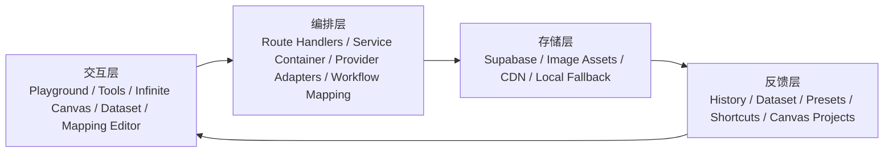

# LEMO Studio（Lemon8 AI Studio）产品理念与技术方案

本文档基于当前仓库实现整理，目标不是复述页面列表，而是把现有模块统一到一条清晰的产品主线中，形成可用于产品对齐、技术拆解和后续演进的共识文档。

## 基本信息

- 产品名称：LEMO Studio（仓库中也沿用了 Lemon8 AI Studio / Lemo AI Studio 命名）
- 当前形态：基于 Next.js App Router 的 AI 图像创作工作台
- 目标用户：内容设计、创意运营、Prompt/Workflow 搭建者、需要高频试错的视觉创作者
- 核心模块：Playground、Infinite Canvas、Dataset、Mapping Editor、Gallery、Tools、Settings
- 关键能力：多模型接入、工作流映射、图像生成与编辑、素材沉淀、项目编排、历史回溯、预设复用
- 当前技术底座：Next.js 15、TypeScript、Tailwind CSS、Zustand/MobX、Next Route Handlers、Supabase 持久化、CDN/对象存储、ComfyUI/LLM Provider 接入

## 一、为什么做这件事

### 1.1 痛点

1. AI 创作工具大多只解决“出一张图”，没有解决“持续产出一批可复用的图”。
2. Prompt、参考图、模型参数、工作流配置、最终结果常常散落在不同工具里，复盘成本高。
3. ComfyUI 这类系统能力很强，但对业务侧和设计侧用户来说，节点结构过于底层，迁移和复用门槛高。
4. 生成结果如果不进入收藏、数据集、项目画布或模板体系，很快就会变成一次性输出，没有组织价值。
5. 多模型并行时代，真正的瓶颈不是“有没有模型”，而是“如何在不同模型、流程和素材之间快速切换，并保留上下文”。

### 1.2 目标

1. 把图像生成从一次性操作升级为持续创作流程。
2. 把 Prompt、参考图、风格、工作流、结果和反馈沉淀为可复用资产。
3. 让初级用户可以直接生成，让高级用户可以通过 Workflow Mapping 和 Infinite Canvas 获得更强控制力。
4. 在一个统一工作台里打通生成、筛选、沉淀、复用和编排。
5. 让团队最终积累的是“创作系统”，而不是一堆孤立图片。

### 1.3 非目标

1. 不把产品做成通用社区内容平台，社交分发不是当前核心。
2. 不自建底层模型训练平台，模型训练和推理由外部 Provider 或现有工作流系统承担。
3. 不试图替代 ComfyUI 的节点编排能力，重点是做一层适合业务创作的抽象与运营界面。
4. 不优先做复杂项目管理和多人协作审批系统，当前重点是创作效率和资产复用效率。

## 二、产品理念：可编排的 AI 创作工作台

### 2.1 核心隐喻

LEMO Studio 不应被理解为“一个更大的 Prompt 表单”，而应被理解为“一个可以摆放创作素材、生成结果、工作流和判断过程的台面”。

这个台面有三个层次：

1. 输入台面：用户定义任务，上传参考图，选择模型、预设、比例和风格。
2. 生产台面：系统把输入编译为具体执行链路，调用 LLM、图像模型或 ComfyUI 工作流。
3. 组织台面：结果进入 History、Gallery、Dataset、Infinite Canvas 和 Preset/Shortcut 体系，成为下一次创作的起点。

### 2.2 护城河：工作流抽象 + 创作记忆

单纯接更多模型不是护城河。LEMO Studio 的长期护城河应来自两件事：

1. 工作流抽象：把复杂的 ComfyUI 或多模型调用封装成业务可以理解和操作的界面层。
2. 创作记忆：把用户做过的选择沉淀下来，让下次创作不必从空白开始。

前者让复杂能力可用，后者让高频创作越来越快。

### 2.3 创作判断力：系统不是替人做决定，而是放大人的判断

真正高杠杆的不是每次都手写更多 Prompt，而是以下几个判断点：

1. 这次任务的目标是什么。
2. 哪个结果值得保留、扩写、进入数据集或进入画布。
3. 哪种参数组合或工作流值得被固化成 Preset、Shortcut 或 Workflow。

系统的责任是缩短“从尝试到判断”的距离，而不是替代判断本身。

### 2.4 每次输出的标准

一张结果图如果只是一张 URL，它的价值很低。标准输出至少应包含：

1. 任务意图：Prompt、编辑指令、风格目标。
2. 参考上下文：参考图、数据集素材、上游节点、预设来源。
3. 执行信息：模型、工作流、Lora、尺寸、批量参数。
4. 输出结果：图片 URL、缩略图、创建时间、状态。
5. 可追溯性：来自哪个项目、哪个用户、哪次任务、是否进入数据集或画布。

### 2.5 快不是“出图快”，而是“试错快 + 切换快 + 复用快”

一个创作系统的效率，不应该只看单次推理耗时，而应该看：

1. 能否快速切换模型和工作流。
2. 能否快速回看历史并再生成。
3. 能否把结果一键沉淀到 Dataset、Gallery 或 Infinite Canvas。
4. 能否把好用配置固化为 Preset、Shortcut 或 Mapping。

### 2.6 信息消费的三层设计

当前产品天然适合三层信息消费：

1. 浏览层：Home、Gallery、Styles/Moodboards、Shortcut 封面，用于激发任务和进入场景。
2. 生产层：Playground、Banner、Describe、Edit、Tools，用于高频生成与编辑。
3. 组织层：History、Dataset、Infinite Canvas、Mapping Editor，用于沉淀、结构化和复用。

### 2.7 设计原则

1. 统一入口，分层复杂度。普通用户先用简单模式，高级用户再进入 Workflow 和 Canvas。
2. 一切结果默认可回溯。不要让结果脱离其 Prompt、参数和来源。
3. 一切高频操作都应可复用。好的工作流不能只停留在一次执行里。
4. 前端只访问同源 `/api/*`，把 Provider 差异留在服务层。
5. 把“保存”和“沉淀”做成产品默认路径，而不是事后补救动作。

## 三、总体架构

### 3.1 三层 + 反馈飞轮



三层职责如下：

1. 交互层：承接用户意图，展示结果，提供选择和编辑入口。
2. 编排层：把用户输入转换为统一执行上下文，路由到 LLM、图像模型或 ComfyUI。
3. 存储层：负责 Generation、Project、Dataset、Preset、Asset 的持久化与检索。

反馈飞轮的意义是，结果不是终点，而是下一次生成的输入。

### 3.2 人的三个触点：低频，但高杠杆

在人机协作里，真正需要人高强度介入的触点只有三个：

1. 定义任务：我想生成什么，风格边界是什么，参考什么。
2. 做出判断：哪些结果可用，哪些值得继续编辑或加入项目。
3. 做资产沉淀：哪些结果应该进入数据集、预设、快捷模板或画布项目。

其余工作尽量交给系统完成，包括参数编译、链路调用、URL 归档和状态持久化。

### 3.3 模块职责表

| 模块 | 产品职责 | 技术职责 |
| --- | --- | --- |
| Playground | 主创作入口，承接文生图、编辑、Describe、Banner、Style 等高频动作 | 统一配置面板、模型选择、Prompt 优化、生成任务发起、历史同步 |
| Mapping Editor | 把底层 Workflow 抽象成业务可操作界面 | 解析 ComfyUI API JSON，建立 UIComponent 到节点参数映射 |
| Infinite Canvas | 把单次生成升级为项目化编排 | 节点/边/资产/历史/队列组织，支持项目快照持久化 |
| Dataset | 把结果沉淀成训练或风格素材库 | 图像上传、排序、Prompt 标注、导出、实时同步 |
| Gallery / History | 回看与复用 | Generation 列表查询、分页、状态和 URL 规范化 |
| Tools | 提供实时图像特效与独立创作工具 | WebGL shader/component 执行、截图与录屏导出 |
| Settings | 管理模型、Provider、默认策略 | API Key、模型绑定、默认服务配置 |

## 四、数据源策略

### 4.1 数据源分层

LEMO Studio 的数据源不只是“模型返回值”，而是四类数据共同组成：

1. 用户输入源：Prompt、参考图、编辑指令、项目节点、快捷模板字段。
2. 结构化配置源：Preset、Shortcut、Workflow Mapping、Style Stack、Banner Template。
3. 外部执行源：Gemini、Coze、ComfyUI、FluxKlein、翻译/描述等 Provider。
4. 内部反馈源：History、Dataset、Project Snapshot、Image Asset、用户选择行为。

### 4.2 接入原则

1. 所有前端统一走同源 `/api/*`，避免页面直接依赖外部 Provider。
2. Provider 差异在服务层消化，对前端暴露统一输入输出格式。
3. 图片和大文件统一归档到 CDN/对象存储，并在业务层记录 `image_assets`。
4. 关键业务对象进入数据库持久化；历史 JSON 或本地文件仅作为兼容兜底，不作为长期主路径。

## 五、Creative Context Engine（核心抽象）

这里的核心模块不是某一个页面，而是一个建议统一出来的抽象：Creative Context Engine。当前项目里，这套能力已经分散存在于 Playground Store、History、Presets、Dataset、Infinite Canvas 和 Workflow Mapping 中，但还没有被显式命名。

### 5.1 数据结构

建议统一出一个 `CreativeContext`：

```ts
interface CreativeContext {
  task: {
    mode: "generate" | "edit" | "describe" | "banner";
    prompt: string;
    intent?: string;
  };
  references: {
    imageUrls: string[];
    datasetIds?: string[];
    upstreamNodeIds?: string[];
  };
  execution: {
    modelId?: string;
    workflowId?: string;
    loras?: string[];
    width?: number;
    height?: number;
    batchSize?: number;
  };
  memory: {
    presetId?: string;
    shortcutId?: string;
    projectId?: string;
    parentGenerationId?: string;
  };
  output: {
    saveToHistory: boolean;
    saveToDataset?: string;
    saveToProject?: string;
  };
}
```

这不是为了新增一层概念，而是为了把当前分散的上下文拼装逻辑标准化。

### 5.2 上下文注入方式

当前项目里，上下文可以从多个入口进入，建议统一成同一套注入机制：

1. 直接输入：Prompt、参考图、模型选择、尺寸参数。
2. Preset/Shortcut 注入：把模板化字段编译成最终 Prompt 和执行参数。
3. Dataset 注入：把收藏素材和标注 Prompt 作为参考上下文。
4. Infinite Canvas 注入：把上游节点输出和连线关系转为当前节点输入。
5. History 注入：从历史结果反向恢复执行上下文，支持再生成或编辑。
6. Workflow Mapping 注入：把 UI 参数翻译为 ComfyUI 节点路径和值。

### 5.3 反馈信号采集

系统真正有价值的反馈，不是简单的“生成成功/失败”，而是：

1. 哪张图被用户保留、下载、再次编辑。
2. 哪张图被加入 Dataset 或拖入 Infinite Canvas。
3. 哪个 Workflow/Preset/Shortcut 被重复使用。
4. 哪种 Prompt 组合与参考图组合产生更高复用率。

这些反馈可以逐步沉淀成排序、推荐和默认策略的依据。

### 5.4 实现策略

短中期建议如下：

1. 短期：保持现有页面结构不变，在服务层或共享工具层新增 Context Builder。
2. 中期：让 `/api/ai/*`、`/api/comfy*`、`/api/history`、`/api/playground-shortcuts` 使用统一上下文字段。
3. 中期：让 Dataset、Preset、Canvas 节点都可以消费同一个 `CreativeContext` 子集。
4. 长期：在 Context 层面做复用推荐，而不是只在页面层做 UI 复用。

## 六、数据结构设计

### 6.1 标准实体

当前项目已经具备一套比较完整的核心实体，建议统一按下面的业务语义理解：

1. `generations`：一次生成或编辑任务的结果与执行信息。
2. `image_assets`：图片在对象存储/CDN 中的统一资产登记。
3. `dataset_collections` / `dataset_entries`：素材集及其成员，承接训练和风格沉淀。
4. `infinite_canvas_projects`：项目级编排快照，包含节点、边、历史和队列。
5. `presets` / `playground_shortcuts` / `style_stacks`：可复用创作模板。
6. `users`：身份与归属。

### 6.2 存储设计

建议把存储职责明确分成三类：

1. 结构化数据：放数据库。
   - 例如 Generation、Dataset Collection、Project Snapshot、Preset、Shortcut。
2. 二进制资产：放对象存储/CDN。
   - 例如生成图、上传参考图、数据集图片、封面图。
3. 兼容兜底数据：保留本地 JSON/Fallback。
   - 用于本地开发、迁移过渡或极端故障场景，不作为长期主路径。

当前代码已经体现这一路径：

1. History 以数据库为主，并保留 URL 规范化与兼容迁移逻辑。
2. Infinite Canvas 以数据库为主，并支持从旧 JSON 项目迁移。
3. Dataset 在业务层同时维护条目、URL 归一和同步事件。

### 6.3 完整链路

一个标准创作链路应是：

1. 用户在 Playground 或 Canvas 中发起任务。
2. 系统组装 `CreativeContext`，路由到具体模型或 Workflow。
3. 输出图片先存为 Image Asset，再写入 Generation/Project/Dataset。
4. 结果进入 History，同时可被加入 Gallery、Dataset、Preset 或 Canvas。
5. 后续任务可从 History、Dataset、Preset、Shortcut 或 Canvas 再次注入上下文。

这条链路闭环后，项目的价值不只来自“多一次生成”，而来自“多一份可复用结构”。

## 七、核心模块详细设计

### 7.1 内容生成管线

内容生成管线建议统一为以下步骤：

1. 输入标准化：文本、参考图、模式、模板字段、节点输入。
2. Prompt 增强：按模式决定是否做优化、翻译、描述或模板拼装。
3. 执行路由：根据模型类型路由到 LLM Image API、ComfyUI、FluxKlein 或编辑链路。
4. 结果落库：保存图片、登记资产、写入 History。
5. 结果分发：进入预览、History、Dataset、Canvas 或下载流程。

### 7.2 结果卡片与历史系统

History 不应只是“最近生成过什么”，而应是系统的默认记忆层。每个结果卡片建议至少支持：

1. 结果预览。
2. Prompt/参数回看。
3. 再生成、编辑、下载。
4. 加入 Dataset。
5. 拖拽到 Infinite Canvas 或进入 Gallery。

这样 History 才能从日志升级为复用入口。

### 7.3 Dataset 设计

Dataset 模块的目标不是单纯“存图”，而是把素材变成有组织、有 Prompt、可导出的创作资产。

建议 Dataset 长期承担三种职责：

1. 素材沉淀：保存值得复用的生成结果或外部素材。
2. 风格对齐：为素材补充中英文 Prompt、系统提示和排序。
3. 训练/运营准备：支持批量导出图片与同名文本，供后续训练或外部使用。

### 7.4 Workflow Mapping 设计

Mapping Editor 是高级能力的关键接口层，核心价值是把复杂节点图翻译成可配置的 UI 面板。

设计重点：

1. 底层保留 Workflow 原貌，不强行改写节点逻辑。
2. 中间层建立 `UIComponent -> workflowPath` 的映射。
3. 上层让 Playground 用统一配置消费这些映射组件。
4. 默认补齐 Seed、Batch Size 等高频参数，降低工作流接入成本。

### 7.5 Infinite Canvas 设计

Infinite Canvas 的意义不是“做一个大画板”，而是把离散生成任务组织成项目。

它适合承接三类场景：

1. 灵感发散：文本节点、图片节点、引用关系并置。
2. 方案比较：不同版本结果在同一空间内对照。
3. 项目编排：把多轮生成、编辑、引用和筛选组织成可继续推进的链条。

从产品上看，Canvas 是项目层；从技术上看，它是对生成结果、节点关系和运行队列的统一持久化容器。

## 八、LLM 使用策略

### 8.1 各环节模型选择

建议按任务阶段分层用模型，而不是所有环节都调用同一个最贵模型：

1. Prompt 优化：优先用低成本文本模型。
2. Describe / Translate：根据精度需求使用视觉或翻译能力模型。
3. 图像生成：根据模式选择 Gemini Image、Coze Seed、ComfyUI Workflow 或 FluxKlein。
4. 高保真批量生产：优先走可控 Workflow，而不是纯黑盒模型。

### 8.2 “创作意图 -> 执行指令” Prompt 设计

本项目的 Prompt 设计不应只追求“写得更长”，而应明确区分两层：

1. 创作意图层：这张图要表达什么，给谁看，什么风格边界不能越过。
2. 执行指令层：镜头、构图、材质、风格词、尺寸、负向限制、编辑动作。

前者帮助系统理解目标，后者帮助模型稳定执行。Shortcut、Preset、Dataset 和 Workflow 都应围绕这两层结构组织。

### 8.3 成本控制

成本控制原则如下：

1. 非必要不做多次文本优化，避免每次输入都走完整 LLM 流程。
2. 默认优先复用 Preset、Shortcut 和 Workflow，减少重复试错。
3. 长链路或批量生产优先走可控 Workflow，避免反复黑盒试探。
4. 大图和参考图在上传前做尺寸和格式规整，减少无效传输。
5. 通过 History、Dataset 和 Canvas 提升复用率，本质上也是成本优化。

## 结语

LEMO Studio 的真正目标，不是成为“又一个 AI 出图页面”，而是成为一个能够积累创作方法、组织结果和放大判断力的创作系统。

如果要用一句话概括这份方案，那就是：

**把一次次生成，变成一套可持续复用的创作基础设施。**
